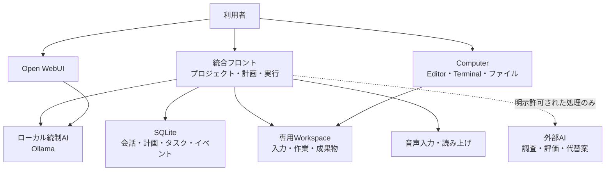
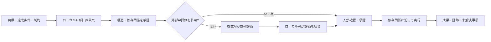

# Local Cowork + Local Voice AI

## ローカルAIを「会話ツール」から「業務を進める共同作業基盤」へ

Local Cowork + Local Voice AIは、Windows PC上で動作するローカル優先のAI共同作業システムです。通常の会話、資料参照、計画作成、表データ処理、成果物作成をローカル環境で進め、必要な場面に限り、利用者の明示的な選択によって外部AIの知見を組み合わせます。

> 目標を定義する → 資料を理解する → 計画を作る → 人が承認する → タスクを実行する → 結果と根拠を残す

---

## 解決したい課題

- 機密資料を外部サービスへ送ってよいか判断しにくい
- チャットの回答が、その後の実作業や成果物作成につながらない
- プロジェクトごとの資料、会話、判断、成果が混在する
- AIが何を実行したのか、なぜ失敗したのか追跡しにくい
- 自律実行を許すと、ファイル削除や範囲外アクセスのリスクがある
- CSVやExcelを処理したいが、生成コードをそのまま実行するのは危険
- ローカルAIだけでは知識が不足する一方、外部AIへ全面依存したくない

Local Coworkは、これらを「ローカル統制」「プロジェクト分離」「承認付き計画」「制限された実行器」「監査可能な記録」で解決します。

---

## システム全体像

| 画面 | 主な用途 |
|---|---|
| 統合フロント | プロジェクト管理、資料登録、計画生成、承認、実行、進捗、成果物 |
| Open WebUI | ローカルモデルとの一般チャット、Knowledge/RAG |
| Computer | 専用Workspace内のファイル、Editor、Terminal、Git、Agent/MCP |

すべてのWebポートは標準で `127.0.0.1` のみに公開し、LANやインターネットへ直接公開しない構成です。

---

## システムの動作

### 1. プロジェクトと資料を分離して管理

プロジェクトごとに、目標、達成条件、制約、固定コンテキスト、登録資料、会話履歴、作業計画、タスク状態、実行イベント、最終報告、専用Workspaceを独立して保持します。

PDF、DOCX、PPTX、CSV、TSV、XLSX、XLSM、Markdown、JSON、各種テキストやソースコードから本文を抽出できます。原本、MIME type、SHA-256、抽出結果も保持し、資料の出所を追跡できるようにしています。

### 2. 目標から実行可能な計画を生成

計画には一意なタスクIDと依存関係があり、自己依存、未定義依存、重複などを保存前に拒否します。最終的な計画決定はローカルAIが行い、実行前には人間の承認を必要とします。

### 3. 依存関係を守って並列実行

- 完了済みタスクを保ったまま一時停止・再開
- 失敗したタスクだけを再試行
- 先行タスク失敗時は、その子孫だけをブロック
- 独立した作業枝は継続
- アプリ再起動時は安全のため実行状態を一時停止へ復元
- 同一プロジェクトの二重実行を防止

### 4. 実行経過を記録

目標、計画、外部AI評価、タスク結果、中途イベント、エラー、最終報告をSQLiteへ保存します。同時に、プロジェクト備忘録をMarkdownとして自動生成します。何を目的に、どの資料を使い、どの順序で処理し、どこまで完了したかを後から確認できます。

### 5. 能力不足を隠さず報告

AIがタスクを完了できない場合は、不足する能力、確認済み手段、必要な権限や入力を記録します。外部AIの利用が許可されている場合は代替案を評価させますが、その回答を直接命令として実行せず、ローカルAIが採否と理由を判断します。

---

## 高度なポイント

### ローカルAIが統制者、外部AIは助言者

ローカルAIがコンテキスト管理、計画、最終判断を担当します。外部AIは明示許可された調査、計画評価、実現手段評価に限定して利用でき、利用不能時もローカル処理へフォールバックできます。

### 生成コードを実行しない表データ処理

CSVやExcel処理では、AIが生成したPythonやシェルをそのまま実行しません。AIは宣言型JSONで操作内容を指定し、安全なローカル実行器が検証して処理します。

- 列・行数・欠損・数値範囲のプロファイル
- 列選択、名称変更、絞り込み、並べ替え
- 日付から年・月・日の派生
- 合計、件数、ユニーク件数、平均、最小、最大
- 列間の加減乗除
- 最大5段の等価結合
- CSV、XLSX、Markdown成果物の保存
- 前段の成果物を使う複数段処理

入力は同じプロジェクトの登録原本または専用Workspace内に限定します。Python、モジュールimport、任意式、シェル、SQL、削除命令は操作スキーマに含めません。

### Workspaceを境界にした安全設計

計画実行AIが扱えるファイル領域は専用Workspace内だけです。ディレクトリ作成、テキスト保存・追記、コピー、移動などに限定し、削除、任意シェル、Workspace外アクセス、symlinkを使った境界回避、同名ファイルへの無言上書きは許可しません。更新前バックアップとatomic writeにも対応します。

### Excelや会計資料をローカル解析

XLSX/XLSMをExcelアプリやマクロを起動せずに解析します。仕訳データでは期間、行数、借方・貸方合計、差額、主要科目などを確認でき、試算表はシート別に構造を表示できます。VBAマクロは実行せず、数式は保存済みキャッシュ値のみを参照します。

### 状態を失いにくい業務設計

目標、資料、計画、依存関係、実行結果を永続化し、停止・再開・失敗からの復旧を業務フローとして設計しています。

---

## 主な特徴

| 特徴 | 企業での価値 |
|---|---|
| ローカル優先 | 機密資料の外部送信範囲を抑制 |
| プロジェクト分離 | 顧客・案件・部門ごとの情報混在を防止 |
| 人による計画承認 | AIの自律実行に統制点を設置 |
| 依存関係付き実行 | 複数工程を順序立て、独立作業は並列化 |
| 宣言型表データ処理 | 任意コード実行を避けてCSV・Excelを加工 |
| 監査イベント | 実行結果、失敗、参照、成果物を追跡 |
| 能力不足レポート | 不可能な処理を成功扱いせず、必要条件を可視化 |
| ローカル＋外部AI連携 | 機密性と外部知見のバランスを選択可能 |
| 音声対応 | キーボード以外の入力経路を提供 |

---

## 活用イメージ

### 経営・業務分析

- 月次CSV・Excelの統合と集計
- 車両、拠点、商品、担当者別の採算確認
- 複数資料からの論点整理
- 経営会議向け報告書の下書き
- 不足データと追加収集項目の明示

### バックオフィス

- 規程、マニュアル、契約関連資料の横断参照
- 定型報告書やMarkdown成果物の作成
- 会計Excelの内容確認支援
- 社内ナレッジを使った問い合わせ対応
- 業務手順の分解と進捗管理

### 開発・運用

- 仕様書とコードを同じプロジェクトで参照
- 改修計画の生成と依存関係整理
- 実行履歴、エラー、未解決事項の記録
- 専用Workspace上での成果物管理

---

## コンサルティングで提供できること

### AI導入・業務整理

- 対象業務の棚卸し
- AIに任せる範囲と人が判断する範囲の設計
- 成果条件、承認点、例外処理の明文化
- PoC対象業務の選定と効果測定

### ローカルAI環境設計

- PC・GPU・メモリに合わせたモデル選定
- Ollama、Docker、Web UIの導入
- 性能、応答時間、同時利用数の検証
- バックアップ、復旧、運用手順の整備

### 社内データ連携

- PDF、Word、PowerPoint、CSV、Excelの取り込み設計
- 既存フォルダ構成や帳票に合わせた処理
- プロジェクト別ナレッジと保存期間の設計
- 業務固有の集計・変換ルール実装

### セキュリティ・ガバナンス

- ローカル処理と外部送信の分類
- 外部AIへ送信できる情報のルール化
- Workspace、権限、監査ログの設計
- 利用規程、確認手順、責任分界の整備

### 個別機能開発

- 社内システムやデータベースとの連携
- 業種別テンプレート、計画、報告書の実装
- 承認ワークフローや権限管理の追加
- 検索・RAG、OCR、音声、表データ処理の強化
- 社内ポータルや既存UIへの統合

---

## 導入の進め方

1. **ヒアリング** — 対象業務、資料、機密区分、現状の工数を整理
2. **適用判断** — ローカルAIに向く処理と、外部サービスが必要な処理を分類
3. **小規模PoC** — 代表的な1業務と実データに近いサンプルで検証
4. **安全設計** — Workspace、送信条件、承認点、ログ、バックアップを確定
5. **個別実装** — 帳票、集計、プロンプト、画面、連携機能を調整
6. **受入テスト** — 正常系、異常系、境界条件、復旧手順を確認
7. **運用開始** — 利用者教育、効果測定、改善サイクルへ移行

PoCでは、回答の自然さだけでなく、処理精度、根拠の追跡性、例外時の停止、作業時間削減、利用者の確認負荷を評価します。

---

## 技術構成

| 領域 | 主な技術 |
|---|---|
| OS | Windows 11 |
| コンテナ | Docker Desktop / Docker Compose |
| 統合API・UI | Python / FastAPI / WebSocket |
| ローカルLLM | Ollama |
| データ保存 | SQLite / Docker named volumes / 専用Workspace |
| AI UI | Open WebUI |
| 作業環境 | Open WebUI Computer |
| 文書・表 | PDF、DOCX、PPTX、CSV、TSV、XLSX、XLSM |
| 音声 | ブラウザ録音、音声認識、ブラウザ読み上げ |
| 外部AI連携 | Claude、ChatGPT、Gemini、Grok、Meta Llama（明示許可時） |

---

## セキュリティと適用範囲

本システムはローカル利用を前提とした業務支援基盤であり、そのままインターネット公開するSaaS、複数組織向け認証基盤、完全自律型のPC操作環境ではありません。

導入時には、利用者認証、端末制御、データ分類、保存期間、バックアップ、外部AIの契約と送信可否、ライセンス、専門家による確認体制を企業ごとに設計する必要があります。ネットワーク公開する場合は、認証、TLS、ファイアウォール、監視の追加が必要です。

AIの出力は専門家の判断を置き換えるものではありません。業務適用では、成果条件、確認者、例外時の停止条件を設計することが重要です。

---

## 本開発が目指すもの

AI導入の価値は、モデルを導入すること自体ではなく、業務の目的、資料、判断、実行、証跡をつなぐことにあります。

1. **機密性** — 可能な処理は手元の環境で完結する
2. **実行力** — 会話だけでなく、計画と成果物までつなげる
3. **統制** — 人の承認、安全な操作範囲、追跡可能な記録を保つ

ローカルAIの導入、既存業務への組み込み、社内資料の活用、Excel集計の自動化、AIガバナンス設計など、実データと実際の運用条件に合わせたコンサルティングへ展開できます。

---

## ご相談時に確認したいこと

- どの業務に時間がかかっているか
- AIへ参照させたい資料やデータ形式
- 外部へ送信できない情報の範囲
- 現在利用しているPC、サーバー、クラウド環境
- 必要な成果物と人による承認工程
- 期待する処理件数、頻度、応答時間
- PoCで確認したい効果と成功条件

これらを整理したうえで、ローカルAIだけで実現する範囲、外部AIや既存システムと連携する範囲、追加開発が必要な範囲を具体化します。

---

*本資料は開発内容を紹介するための公開用概要です。掲載内容は現行実装を基にしていますが、導入先の環境、使用モデル、契約、セキュリティ要件により構成と利用可能な機能は変わります。APIキー、認証情報、顧客データ、内部ネットワーク情報は本資料に含みません。*
