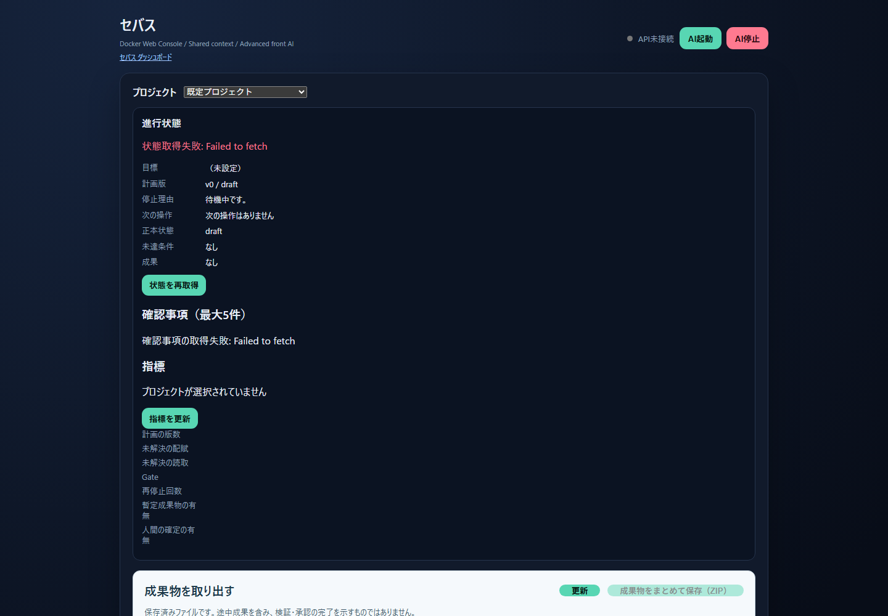
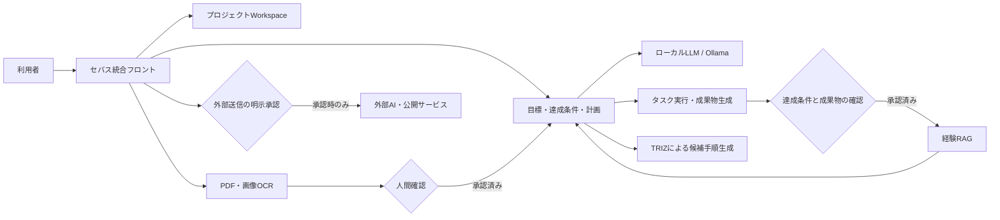
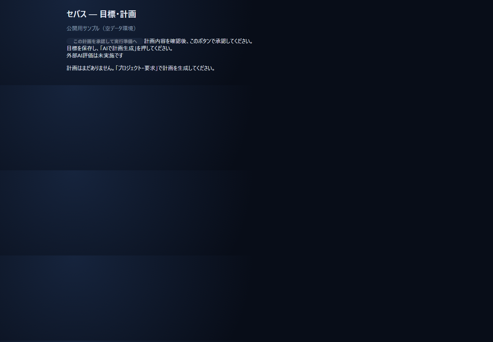
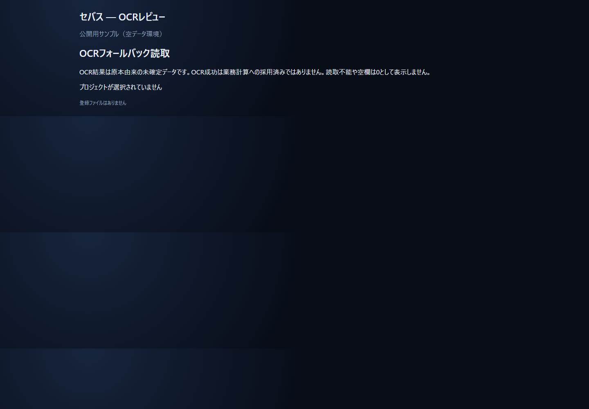
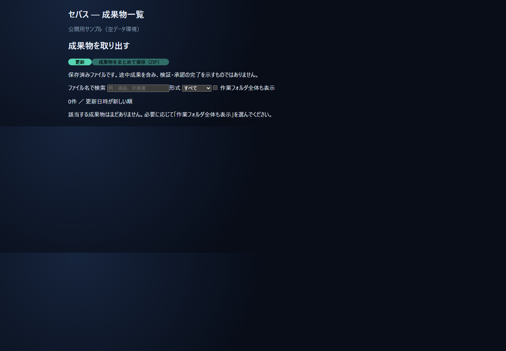
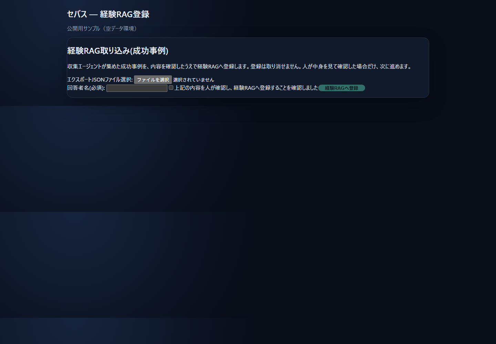
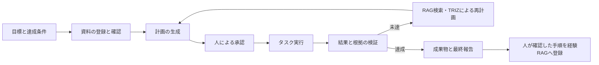

# セバス

**セバス**は、利用者が定めた目標を、資料の理解、計画、承認、実行、検証、成果物の保存まで一貫して進めるローカル優先のAI作業システムです。

通常の処理はPC内のOllamaで行います。外部AIや外部サービスは、利用者が明示的に選択・承認した場合に限って使用します。



> 公開用の空データ環境で撮影した画面です。実際の業務データや個人情報は含みません。

最新の稼働状態と再開位置は [セバス作業記憶](docs/SEBAS_WORK_MEMORY.md) を参照してください。

## システム構成



通常処理、資料、履歴、RAGはローカル環境に置きます。OCR結果、実行結果、外部送信には独立した確認・承認段階があります。

## 主な画面

### 目標・計画



### OCRレビュー



### 成果物一覧



### 経験RAG登録



> すべて公開用の空データ環境で撮影しています。業務資料、実行履歴、個人名、社名、認証情報は含みません。

## セバスができること

- 目標と達成条件を記録し、完了条件から逆算して計画を作る
- 大きな計画を段階とタスクへ分解し、進捗と未達条件を管理する
- PDF、文書、表計算、画像などをプロジェクト資料として保存・参照する
- RAGで既存資料や、人が承認した成功手順を再利用する
- 既存手順で解決できない問題にTRIZを適用し、候補手順を生成・比較する
- OCR結果を人が確認し、承認済みデータだけを後続計算へ渡す
- 車両別・月別損益の入力整理、配賦、照合、Excel成果物生成を支援する
- 実行履歴、根拠、承認、失敗理由、成果物をプロジェクト単位で残す

## 基本の流れ



セバスは、ファイルを作っただけでは目標達成と判定しません。達成条件、根拠、必要な人間承認が揃うまで、未達または確認待ちとして扱います。

## 3つの画面

| 画面 | 既定URL | 用途 |
|---|---|---|
| セバス統合フロント | http://127.0.0.1:8099 | 目標、計画、実行、承認、OCR確認、成果物管理 |
| Open WebUI | http://127.0.0.1:3000 | ローカルモデルとの会話、Knowledge/RAG |
| Computer | http://127.0.0.1:8000 | Workspace、ファイル、Editor、Terminal、Git |

すべて既定で `127.0.0.1` にだけ公開されます。

## 主な機能

### 目標達成管理

目標、達成条件、制約を保存し、計画の各タスクがどの達成条件を満たすか確認します。再起動時は実行中タスクを自動続行せず、一時停止状態として復元します。

### 手順学習と経験RAG

実行結果を人が確認し、問題がない場合だけ成功手順として登録できます。未承認、失敗、改ざん検知、不明状態のデータは経験RAGへ登録しません。

### TRIZによる手順発明

既存手順やRAGで解決できない場合、技術・業務・文書・表処理を含む一般的な問題へTRIZを適用します。生成した候補は実験と比較を経て、人が採用を判断します。

### OCRとPDF処理

PDFの通常抽出が不十分な場合にOCRフォールバックを利用できます。OCRは既定で無効です。`failed`、`needs_review`、未承認、原本整合性エラーの結果は計算や経験RAGへ渡しません。

### 車両別月次損益

売上、給与、燃料、高速代、保険、リースなどを車両・月単位へ整理し、配賦根拠と照合結果を保持してExcel成果物を生成します。空欄、0円、読取不能、不明は別の状態として扱います。

## 必要な環境

- Windows 11
- Docker Desktop
- Ollama
- PowerShell 7推奨
- NVIDIA GPUは任意。OCRや大規模モデルでは推奨

Python単体で開発する場合はPython 3.11～3.13を使用します。

## 導入

```powershell
git clone https://github.com/Nemosoft1963/sebas.git C:\LocalCowork\sebas
Set-Location C:\LocalCowork\sebas
Copy-Item .env.example .env
.\scripts\setup.ps1
```

`.env` のAPIキー、OAuth情報、SMTP認証情報はGitへ登録しないでください。

## 起動

```powershell
Set-Location C:\LocalCowork\sebas
.\scripts\start.ps1
```

初回またはフロントを再構築する場合:

```powershell
.\scripts\start.ps1 -BuildFront -Check
```

状態確認:

```powershell
.\scripts\status.ps1
.\scripts\healthcheck.ps1
```

停止:

```powershell
.\scripts\stop.ps1
```

データ、Workspace、Docker volumeは通常の停止では削除されません。

## 最初の操作

1. `http://127.0.0.1:8099` を開く。
2. プロジェクトを作成する。
3. 目標、達成条件、制約を入力する。
4. 必要な資料を登録する。
5. 計画を生成し、内容と達成条件の対応を確認する。
6. 問題がなければ承認して実行する。
7. 成果物、根拠、未達項目を確認する。
8. 人が確認した成功手順だけを経験RAGへ登録する。

## 安全上の原則

- 読めない値や不明値を0円、成功、承認済みとして扱わない
- OCR結果を信頼済みデータとして直接利用しない
- 外部送信、公開、連絡は人間承認を経て実行する
- 原本SHA-256とmanifestを承認・公開・RAG登録前に再検証する
- Docker socket、ホストドライブ全体、資格情報領域をマウントしない
- `docker compose down -v`、`docker volume prune`、`docker system prune -a` を通常運用で使わない

## 現在の制約

次の受入確認は公開時点で継続中です。

- 代表的な実PDFを使ったOCR受入
- 実案件データによる車両別月次損益の一連受入
- 残っている業務確認事項への回答

これらを完了済みとして扱わないでください。

## ドキュメント

| 資料 | 内容 |
|---|---|
| [システム概要](PUBLIC_SYSTEM_OVERVIEW.md) | 目的、構成、機能、データの流れ |
| [AI・開発者向け詳細仕様](SYSTEM_DESCRIPTION_FOR_AI.md) | モジュール、API、状態管理、設計原則 |
| [利用例](NOTE_USE_CASES.md) | 想定業務と使い方 |
| [運用ガイド](OPERATIONS.md) | 起動、停止、バックアップ、障害対応 |
| [セキュリティ](SECURITY.md) | 信頼境界、ネットワーク、秘密情報 |
| [経験RAG設計](EXPERIENCE_RAG_DESIGN.md) | 成功手順の保存と再利用 |
| [公開版について](PUBLIC_RELEASE.md) | 公開時に除外したデータと既知の未完了事項 |
| [対応環境](SUPPORTED_ENVIRONMENTS.md) | 対応OS、推奨メモリ、GPU、容量 |
| [変更履歴](CHANGELOG.md) | 利用者向けの主な変更 |
| [第三者ライセンス](THIRD_PARTY_NOTICES.md) | 主な依存関係と再配布時の注意 |
| [貢献方法](CONTRIBUTING.md) | Issue、開発、Pull Request手順 |

## 開発とテスト

```powershell
python -m pip install -r requirements.txt
python -m pytest -q
```

GitHub Actionsでも全pytestを実行します。

## ライセンス

セバスは [Apache License 2.0](LICENSE) で公開しています。Copyright 2026 Nemosoft1963。外部ライブラリおよびDockerイメージには、それぞれの提供元が定めるライセンスが適用されます。
