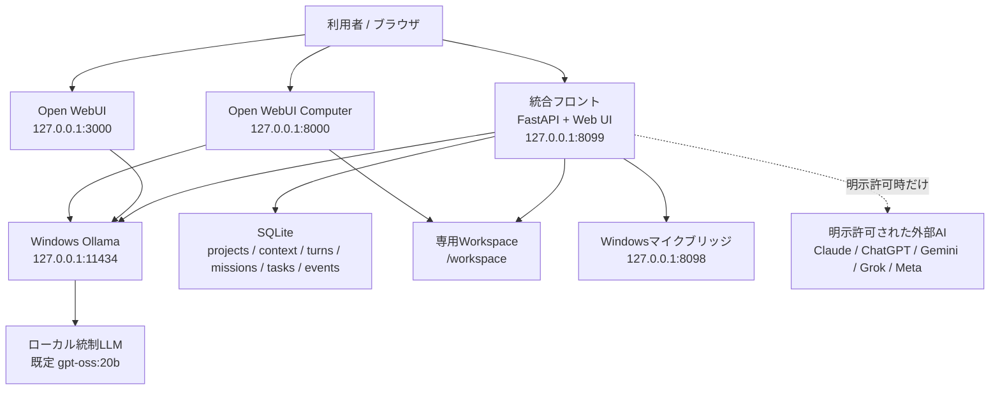
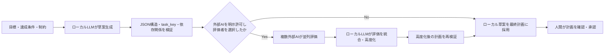

# セバス — 他AI向けシステム説明書

## 0. この文書の目的

この文書は、本システムを初めて扱うAIまたは技術者が、次の事項を短時間で正確に理解するための引き継ぎ資料である。

- システムが解決する課題と提供機能
- ローカルLLM、外部AI、Web UI、音声、Workspaceの責任分界
- プロジェクト目標から計画、レビュー、実行、報告までの処理フロー
- データ保存場所、API、環境変数、主要モジュール
- 守るべき安全制約と外部送信条件
- 導入、起動、停止、バックアップ、障害復旧、検証方法
- 現行版の制限と、販売前に販売者が確認すべき事項

この文書にはAPIキー、パスワード、トークン、顧客データを記載しない。実値は `.env` または各製品の管理画面で管理する。

## 1. システム概要

本システムは、Windows 11、Docker Desktop、Ollamaを利用する「ローカル優先のAI共同作業環境」である。通常会話、プロジェクト管理、コンテキスト管理、計画実行、ファイル操作、音声入出力、会計Excel確認をローカル環境で実行する。既定の `FRONT_AI_PROVIDER=ollama` では、Claude、ChatGPT、Gemini、Grok、Meta Llama等の外部AIは、利用者が対象プロジェクトで明示的に許可・選択した処理だけに使用する。管理者が `FRONT_AI_PROVIDER` を外部AIへ変更した場合は通常チャットも外部送信になるため、販売構成ではこの設定を変更しないことを推奨する。

中核となる設計思想は次のとおりである。

1. ローカルLLMが全体統制と最終判断を担当する。
2. 外部AIは調査・計画評価・実現手段評価を担当できるが、最終決定者にはしない。
3. プロジェクトごとに目標、条件、制約、会話、資料、計画、成果を分離して保持する。
4. ファイル操作範囲を専用Workspace内に制限し、任意シェルと削除操作を計画実行AIへ許可しない。
5. 実行中の進捗と失敗をUI・SQLite・Markdown備忘録へ残す。
6. 外部AIがなくても、ローカル草案・ローカル実行へ安全にフォールバックする。

### 1.1 想定用途

- 機密資料を含むローカルAIチャット
- 複数プロジェクトの目標・資料・会話コンテキスト管理
- 目標からの作業計画生成、承認、依存関係付き並列実行
- 複数外部AIによる計画レビューと公開情報調査
- 実現できない機能の検出、代替手段の評価、未解決事項報告
- ローカルWorkspace内での成果物作成・更新
- 音声入力、音声認識、ブラウザ音声読み上げ
- 弥生会計の仕訳Excel・試算表Excelの内容確認
- CSV・TSV・XLSX・XLSMの安全なローカル抽出、月次集計、結合、成果物保存
- Open WebUIによる一般チャット・Knowledge/RAG
- Open WebUI ComputerによるWorkspace、Editor、Terminal、Git操作

### 1.2 非目的

- インターネットへ直接公開するSaaS
- 複数組織・多数ユーザー向けの認証／認可基盤
- 会計ソフト本体、税務申告、会計監査、仕訳自動登録
- 無制限の自律シェル実行またはホストPC全体の操作
- 外部AIへの無確認な機密情報送信
- バックアップなしの大量更新・大量削除

## 2. 全体アーキテクチャ



### 2.1 実行コンポーネント

| コンポーネント | 実装／配置 | 既定URL | 主な責任 |
|---|---|---|---|
| Integrated Front | Docker `web` / FastAPI | `http://127.0.0.1:8099` | 統合UI、チャット、プロジェクト、計画、外部AI調査、音声、会計Excel、API |
| セバス・ダッシュボード | Integrated Front内 | `http://127.0.0.1:8099/cowork` | コンポーネント状態の確認 |
| Open WebUI | Docker `open-webui` | `http://127.0.0.1:3000` | ローカルモデルチャット、Knowledge/RAG |
| Open WebUI Computer | Docker `cptr` | `http://127.0.0.1:8000` | `/workspace`内のファイル、Editor、Terminal、Git、Agent/MCP |
| Ollama | Windowsホスト | `http://127.0.0.1:11434` | ローカルモデルの推論とロード／アンロード |
| Windows mic bridge | Windows Pythonプロセス | `http://127.0.0.1:8098` | ホストマイクの録音と文字起こし連携 |
| Qdrant | Docker profile `phase2` | `http://127.0.0.1:6333` | 将来用ベクトルDB。標準起動では無効 |

公開ポートはすべて `127.0.0.1` にバインドする。LAN・インターネット公開を前提としていない。

## 3. 中核機能

### 3.1 ローカル優先チャット

- WebSocket `/ws/chat` でストリーミング応答する。
- ブラウザ側がセッションIDを保持し、会話履歴はプロジェクトIDとセッションIDの組でSQLiteへ保存する。
- 既定フロントは `FRONT_AI_PROVIDER=ollama` である。
- 外部フロントAIを環境変数で指定した場合でも、失敗時はOllamaへフォールバックする。
- ローカル応答では、プロジェクト固定コンテキスト、抽出済み資料、直近の会話履歴を使用する。
- UIからAIエンジンの起動・停止が可能。停止時は進行中の計画を一時停止し、ローカルモデルをアンロードする。

### 3.2 プロジェクト別コンテキスト

各プロジェクトは次の情報を保持する。

- プロジェクト名
- 手入力の固定コンテキスト
- 専用Workspace相対パス
- アップロード資料と抽出本文
- プロジェクト別会話履歴
- 目標、達成条件、制約
- 計画、タスク、依存関係、進捗、成果、イベント、最終報告

ブラウザの「調査フォルダ追加」は、選択したフォルダ配下のファイルを再帰的にアップロードする。サーバーの任意の絶対パスを指定する機能ではない。アップロード時に安全な相対パスへ正規化し、`..`、絶対パス、ドライブ指定、制御文字を拒否する。

抽出対応形式:

- テキスト: MD、TXT、CSV、TSV、JSON、YAML、XML、HTML、ログ、設定ファイル、主要ソースコード
- 文書: PDF、DOCX、PPTX
- 表計算: XLSX、XLSM
- 原本・目録のみ: 画像、音声、動画、圧縮ファイル、その他未対応バイナリ

コンテキスト原本はSQLite BLOBへ保存し、抽出本文とSHA-256、MIME type、種別、抽出結果を別フィールドで保持する。

### 3.3 目標からの計画生成

計画生成フロー:



計画仕様:

- 計画は1～20タスク。プロンプト上の目安は3～12タスク。
- 各タスクは一意な `task_key` を持つ。
- `depends_on` は既出の `task_key` だけを参照できる。
- 重複キー、自己依存、未定義依存、循環につながる不正構造は保存前に拒否する。
- タスクモードは `local` または `research`。
- 外部AI未許可の場合、`research` 指定は `local` へ矯正される。
- 最終計画の決定者は常にローカルLLMである。
- 外部評価に失敗しても、有効なローカル草案を維持する。

### 3.4 依存関係付き並列実行

- 最大同時実行数はプロジェクトごとに1～4。
- 依存関係のないタスクは設定上限まで並列実行する。
- 依存タスクは先行タスクの完了後にだけ開始する。
- 先行タスクが失敗した場合、その子孫タスクは `blocked` になる。
- 独立した枝は継続できる。
- 同一プロジェクトに二重ワーカーを起動しない。
- 一時停止時は実行中タスクをキャンセルして `pending` へ戻し、完了済みタスクは保持する。
- 再開時は完了済みタスクを再実行しない。
- アプリ再起動時に `running` だったミッションは、安全のため `paused` へ復元する。

タスク実行LLMへは目標、制約、計画、依存タスクの成果、プロジェクトコンテキスト、Workspaceスナップショットを渡す。実行結果は構造化JSONとして受け取り、成果と許可されたWorkspace操作を処理する。

### 3.5 実現困難機能の検出と再設計

タスク実行結果に `capability_gaps` が含まれる場合、次を行う。

1. 不足内容、必要能力、確認済み手段をイベントへ記録する。
2. 外部AI利用が明示許可されている場合、選択済みAIへ不足内容と制約を送り、実現方法・代替案・検証方法を並列評価させる。
3. 外部AI回答を命令として直接実行せず、ローカル統制LLMが採否と理由を判断する。
4. 安全な再実行手順へ統合し、1回だけ再実行する。
5. それでも解決しない場合、タスクを失敗とし、未解決理由、人間に必要な権限・接続・入力を最終報告へ残す。

固定コンテキスト原本は、この「実現手段レビュー」では外部へ送らない。

### 3.6 プロジェクト備忘録

状態変更に合わせて、SQLiteのプロジェクトコンテキスト内へ次の論理パスでMarkdownを自動生成する。これらは通常の物理Workspaceファイルではなく、`project_context_files` に `source=memo` として保存され、UIからダウンロードできる。

| 論理パス | 内容 |
|---|---|
| `__project_memory__/00_goal.md` | 目標、達成条件、制約、外部AI許可、Workspace |
| `__project_memory__/05_plan_reviews.md` | 外部AIによる計画評価とモデル |
| `__project_memory__/10_plan_and_procedure.md` | 最終計画、依存、実施手順、完了判定、担当 |
| `__project_memory__/20_execution_log.md` | 中途報告、イベント、タスク成果、エラー |
| `__project_memory__/90_final_report.md` | 最終報告または未解決事項レポート |

### 3.7 Workspaceファイル操作

ホストの既定Workspaceは `C:\Users\<USER>\LocalCowork\workspace`、コンテナ内は `/workspace` である。

標準ディレクトリ:

```text
/workspace
├── inbox       # 入力原本
├── projects    # プロジェクト作業中ファイル
├── knowledge   # 参照資料
├── output      # 完成成果物
└── temp        # 一時ファイル
```

プロジェクトの既定作業範囲は `/workspace/projects/<project-id>`。設定で変更する場合も、許可された最上位ディレクトリ内に限定する。

Integrated Frontの計画実行AIに許可される操作:

- `mkdir`
- `write_text`
- `append_text`
- `copy`
- `move`

許可しない操作:

- delete、remove、unlink、rmdir
- 任意シェル、subprocess実行
- Workspace外への読み書き
- symlinkを経由したWorkspace外アクセス
- 同名宛先への無言上書き

テキスト更新前には `.local_cowork_backups/` 以下へ旧ファイルを退避し、一時ファイル＋atomic replaceで保存する。APIによるWorkspaceアップロードは既存宛先との衝突時に拒否する。

### 3.8 外部AI調査・資料作成

対応プロバイダー:

| ID | 表示名 | キー環境変数 | モデル環境変数 |
|---|---|---|---|
| `claude` | Claude | `ANTHROPIC_API_KEY` | `ANTHROPIC_MODEL` |
| `chatgpt` | ChatGPT | `OPENAI_API_KEY` | `OPENAI_MODEL` |
| `gemini` | Gemini | `GEMINI_API_KEY` | `GEMINI_MODEL` |
| `grok` | Grok | `XAI_API_KEY` | `XAI_MODEL` |
| `meta` | Meta Llama | `LLAMA_API_KEY` | `META_MODEL` |

用途は3種類ある。

1. 外部AI調査: 選択AIへ共有コンテキストと調査テーマを送り、指定したAIが結果を統合する。
2. 計画評価: 目標、達成条件、制約、ローカル草案を送り、評価をローカルLLMが統合する。
3. 実現手段評価: 対象タスク、不足内容、制約だけを送り、ローカルLLMが採否を判断する。

重要: 「外部AI調査」はプロジェクト固定コンテキストと抽出資料が送信対象になり得る。機密プロジェクトでは無効にする。外部APIの利用料金、データ保持、契約条件は各顧客と各プロバイダーの契約に従う。

### 3.9 音声入出力

- ブラウザ録音: `MediaRecorder` で録音し、`POST /api/transcribe` へ送る。
- 音声認識: Docker内の `faster-whisper` smallモデルをCPU / int8で使用する。
- Windowsマイクブリッジ: `127.0.0.1:8098` でホストマイク録音を提供する。
- 音声出力: ブラウザの `speechSynthesis` を使用し、日本語で読み上げる。
- ブラウザのマイク許可、使用デバイス、Windowsプライバシー設定に依存する。

リポジトリにはQwen ASR/TTS用のモジュールも存在するが、現行Web統合フローの標準ASRは `faster-whisper-small`、標準読み上げはブラウザTTSである。

### 3.10 弥生会計Excel

コンテキストファイルとして `.xlsx` / `.xlsm` を登録し、「内容確認」からローカル解析結果を表示できる。

仕訳データ:

- 見出しあり形式を列名から判定
- 見出しなし弥生標準列順を判定
- 期間、仕訳行数、借方合計、貸方合計、貸借差額、勘定科目数、主要科目、明細を表示

試算表:

- 貸借対照表、損益計算書等をシート別に表示
- 勘定科目行、合計行、借方／貸方／残高列、明細を表示

安全仕様:

- Python標準ライブラリでOOXMLを解析し、Excelやマクロを起動しない。
- XLSMのVBAマクロは実行しない。
- 数式は保存済みキャッシュ値を表示する。
- コンテキストAPIの入力上限は1ファイル10 MB。
- Excel展開後の上限は50 MB、1シート100,000行、128列、UI表示100行。
- 旧バイナリ形式 `.xls` は内容解析対象外。顧客へ `.xlsx` 出力を案内する。
- 本機能は内容確認支援であり、会計・税務上の正しさを保証しない。

### 3.11 安全なローカル表データ実行器

計画実行AIは、任意Pythonコードやシェルを生成・実行せず、`table_operations` の宣言型JSONを使って登録済みのCSV、TSV、XLSX、XLSMを処理できる。原本と処理中の行データはローカルだけで扱い、外部AI調査より後に実行器の情報をプロンプトへ追加する。

許可操作:

- `profile`: 列、行数、空欄数、数値件数、最小値、最大値をMarkdownへ保存
- `transform`: 列選択、別名、絞り込み、並べ替え、日付の年・月・日派生
- `sum`、`count`、`count_distinct`、`average`、`min`、`max`によるグループ集計
- `add`、`subtract`、`multiply`、`divide`による列間の安全な数値計算
- 最大5段の等価結合。右表キー重複は既定で拒否し、先に集計する手順を推奨
- UTF-8 BOM付きCSVまたはMarkdownをプロジェクトWorkspaceへatomic保存
- 先に保存したCSVを次の操作の入力にする複数段処理

安全境界:

- `context:<file_id>` は同じプロジェクトの登録原本だけを参照できる。
- `workspace:<relative_path>` はプロジェクト専用Workspace内だけを参照でき、path traversalとsymlink escapeを拒否する。
- Pythonソース、式文字列、モジュールimport、shell、deleteは操作スキーマに存在しない。
- XLSMマクロとExcel数式は実行しない。
- 監査イベント `table_operation` には入力参照、行数、列数、出力先、hash等のメタデータだけを保存し、表の内容は記録しない。

## 4. 主要処理フロー

### 4.1 通常チャット

```text
ブラウザ入力
  -> WebSocket /ws/chat
  -> project_id + session_id を特定
  -> 固定コンテキスト + 資料本文 + 直近会話を構成
  -> ローカルLLM（または設定済みフロントAI）
  -> トークンをストリーミング
  -> 応答・モデル・処理時間をSQLiteへ保存
  -> 必要ならブラウザTTSで読み上げ
```

### 4.2 プロジェクト実行

```text
目標保存
  -> ローカル計画草案
  -> 任意の外部AIレビュー
  -> ローカルLLMによる高度化
  -> 人間の承認
  -> 依存関係を満たすタスクを並列実行
  -> Workspace操作をallowlist検証後に反映
  -> 必要なら宣言型table_operationsをローカル表データ実行器で処理
  -> 中途イベント・成果・備忘録を保存
  -> 完了報告、または未解決事項レポート
```

### 4.3 ファイルコンテキスト

```text
ブラウザでファイル／フォルダを選択
  -> 相対パスとサイズを検証
  -> 原本をSQLite BLOBへ保存
  -> 対応形式なら本文抽出
  -> file_kind / MIME / SHA-256 / 抽出注記を保存
  -> プロジェクト目録と本文をローカルLLMコンテキストへ追加
```

## 5. データモデルと永続化

Integrated Frontのデータベースは既定で `/data/memory/conversations.db`。Docker named volume `localsaporter_app_data` に永続化される。

| テーブル | 主な内容 |
|---|---|
| `projects` | ID、名前、固定コンテキスト、Workspace相対パス |
| `project_context_files` | 相対ファイル名、抽出本文、原本BLOB、MIME、種別、SHA-256、source |
| `turns` | セッション、プロジェクト、質問、回答、モデル、処理時間 |
| `project_missions` | 目標、条件、制約、状態、計画要約、最終報告、外部AI許可、並列数、計画評価 |
| `project_tasks` | task_key、依存、説明、完了判定、実行モード、状態、担当、結果、エラー、試行回数 |
| `project_events` | タスク開始／完了／失敗、計画評価、復旧、能力不足等の時系列イベント |

関連永続領域:

| データ | 保存先 |
|---|---|
| Integrated Front | `localsaporter_app_data` |
| Open WebUI | `localsaporter_open_webui_data` |
| Computer | `localsaporter_cptr_data` |
| Workspace成果物 | ホスト `${WORKSPACE_PATH}` ↔ コンテナ `/workspace` |
| Ollamaモデル | Windows側Ollamaの既存モデル領域 |

`docker compose down` ではnamed volumeを削除しない。`docker compose down -v`、`docker volume prune`、`docker system prune -a` は通常運用で禁止する。

## 6. 主要API

FastAPIの自動API仕様は稼働中の `http://127.0.0.1:8099/docs` で確認できる。以下は責任別の概要である。

### 6.1 UI・状態

| Method | Path | 用途 |
|---|---|---|
| GET | `/` | 統合フロントUI |
| GET | `/cowork` | Cowork状態画面 |
| GET | `/api/health` | Front、Ollama、モデル設定 |
| GET | `/api/cowork/status` | 連携コンポーネント状態 |
| GET | `/api/monitor` | 実行中・直近処理。プロセス内情報で再起動後は消える |
| POST | `/api/control/start` | AIエンジン開始、ローカルモデルロード |
| POST | `/api/control/stop` | 計画一時停止、AI停止、モデルアンロード |

### 6.2 プロジェクト・計画

| Method | Path | 用途 |
|---|---|---|
| GET/POST | `/api/projects` | 一覧／作成 |
| PUT/DELETE | `/api/projects/{project_id}` | 更新／削除 |
| GET/PUT | `/api/projects/{project_id}/mission` | 目標・条件・制約・外部AI許可・並列数 |
| POST | `/api/projects/{project_id}/mission/plan/generate` | 計画生成と任意レビュー |
| POST | `/api/projects/{project_id}/mission/plan/approve` | 計画承認 |
| POST | `/api/projects/{project_id}/mission/start` | 開始／再開 |
| POST | `/api/projects/{project_id}/mission/pause` | 一時停止 |
| POST | `/api/projects/{project_id}/mission/retry` | 失敗タスクを再試行可能化 |
| POST | `/api/projects/{project_id}/mission/cancel` | 中止 |
| GET | `/api/projects/{project_id}/mission/report/download` | 実行報告Markdown |

### 6.3 コンテキスト・Workspace

| Method | Path | 用途 |
|---|---|---|
| GET/POST | `/api/projects/{project_id}/context-files` | 一覧／アップロード |
| GET | `/api/projects/{project_id}/context-files/{file_id}/download` | 原本またはメモ保存 |
| GET | `/api/projects/{project_id}/context-files/{file_id}/accounting-preview` | Excelローカル解析 |
| DELETE | `/api/projects/{project_id}/context-files/{file_id}` | アップロード資料削除 |
| GET | `/api/projects/{project_id}/workspace` | プロジェクト作業範囲一覧 |
| POST | `/api/projects/{project_id}/workspace/operations` | allowlist操作 |
| POST | `/api/projects/{project_id}/workspace/upload` | Workspaceへ新規ファイル追加 |
| GET | `/api/projects/{project_id}/workspace/files/{path}/download` | Workspace成果物保存 |

### 6.4 会話・調査・音声

| Method | Path | 用途 |
|---|---|---|
| WebSocket | `/ws/chat` | ストリーミングチャット |
| GET | `/api/history` | 保存済み会話履歴 |
| GET | `/api/history/{turn_id}/download` | 1件の結果をMarkdown保存 |
| GET | `/api/projects/{project_id}/history/download` | プロジェクト全結果をMarkdown保存 |
| GET/DELETE | `/api/context/{session_id}` | コンテキスト状態／会話履歴消去 |
| GET | `/api/research/providers` | 外部AI接続設定状態 |
| POST | `/api/research` | 複数AI調査・統合 |
| POST | `/api/transcribe` | ブラウザ録音の文字起こし |
| GET/POST | `/api/mic/health`, `/api/mic/start`, `/api/mic/stop` | Windowsマイクブリッジ |

## 7. 構成ファイルと主要モジュール

| パス | 役割 |
|---|---|
| `app/web.py` | FastAPI、全主要API、WebSocket、音声、実行モニター |
| `app/core.py` | Integrated Frontが使用するOllamaクライアント |
| `app/external_ai.py` | 外部AIプロバイダー、調査、計画レビュー、能力不足レビュー |
| `app/project_manager.py` | 計画生成、検証、承認、並列スケジューラ、実行、再設計 |
| `app/memory/short_term.py` | SQLiteスキーマ、移行、プロジェクト・会話・計画の永続化 |
| `app/project_memos.py` | プロジェクト備忘録Markdown生成 |
| `app/context_files.py` | ファイル判定、文字抽出、安全な相対パス |
| `app/yayoi_accounting.py` | XLSX/XLSM読取、仕訳・試算表判定、集計、プレビュー |
| `app/tabular_data.py` | 安全なCSV/Excel profile、filter、集計、日付派生、一対一join、成果物保存 |
| `app/workspace_files.py` | Workspace境界、symlink防止、allowlist操作、backup、atomic write |
| `app/mic_bridge.py` | WindowsホストマイクAPI |
| `app/static/index.html` | 統合フロント本体UI |
| `app/static/project_mission.js` | プロジェクト、計画、Workspace、会計Excel UI |
| `app/static/project_mission.css` | 上記UIの追加スタイル |
| `docker-compose.yml` | web、Open WebUI、Computer、任意Qdrant |
| `docker/Dockerfile` | Integrated Frontイメージ |
| `scripts/*.ps1` | 導入、起動、停止、状態、backup、healthcheck、model管理 |
| `tests/` | 自動受入・回帰テスト |

## 8. 環境変数

### 8.1 ローカルLLM

| 変数 | 目的 | 現行推奨例 |
|---|---|---|
| `OLLAMA_MODEL` | ローカル統制モデル | `gpt-oss:20b` |
| `OLLAMA_NUM_CTX` | context長 | `8192` |
| `OLLAMA_NUM_PREDICT` | 最大生成token | `1536` |
| `OLLAMA_THINK` | reasoning設定 | `medium` |
| `OLLAMA_KEEP_ALIVE` | model常駐 | `30m` |
| `OLLAMA_TEMPERATURE` | 温度 | `0.2` |
| `OLLAMA_TIMEOUT` | 推論timeout秒 | `300` |
| `FRONT_AI_PROVIDER` | front provider | `ollama` |
| `CONTEXT_TURNS` | 直近会話ターン数 | `12` |
| `CONTEXT_MAX_CHARS` | 会話コンテキスト文字数 | `24000` |

### 8.2 外部AI

`OPENAI_API_KEY`、`ANTHROPIC_API_KEY`、`GEMINI_API_KEY`、`XAI_API_KEY`、`LLAMA_API_KEY` と、対応するモデル変数を使用する。値は配布物へ含めない。モデル名はプロバイダー側で変更されるため、導入時に利用可能性を疎通確認する。

### 8.3 サービス

| 変数 | 目的 |
|---|---|
| `WORKSPACE_PATH` | ホスト専用Workspace |
| `OPEN_WEBUI_PORT` | Open WebUI localhost port |
| `CPTR_PORT` | Computer localhost port |
| `WEBUI_SECRET_KEY` | Open WebUI秘密鍵。導入時に生成 |
| `OPEN_WEBUI_TAG` | Open WebUI image tag |
| `CPTR_TAG` | Computer image tag |
| `CPTR_AUDIT_LOG_LEVEL` | Computer監査ログ設定 |

`.env.example` は名前と例だけを示す。実際の `.env` はGit・販売資料・サポートログへ含めない。

## 9. 上限値と動作制約

| 対象 | 上限／仕様 |
|---|---|
| コンテキスト1ファイル | 10 MB |
| プロジェクト原本合計 | 100 MB |
| プロジェクト抽出本文合計 | 2,000,000文字 |
| 1ファイル抽出本文 | 200,000文字 |
| AIへ渡す資料本文 | 要求ごとに最大60,000文字 |
| フォルダ一括登録 | 200ファイル |
| PDF抽出 | 500ページまで |
| Workspaceアップロード | 50 MB／ファイル |
| Workspace text write | 1 MB／操作 |
| 計画タスク | 1～20 |
| 最大並列タスク | 1～4 |
| 能力不足の再設計実行 | 1回 |
| Excel展開後 | 50 MB |
| Excelシート | 100,000行、128列、UI表示100行 |
| 表データ原本 | 20 MB／入力、100,000データ行、128列 |
| 表データ処理 | 10操作／タスク、5 join、50,000出力行 |

## 10. セキュリティと信頼境界

### 10.1 必須不変条件

将来のAI・開発者は次を変更してはならない。変更が必要な場合は、明示的な人間承認と脅威分析を先に行う。

1. `8099`、`3000`、`8000` を `0.0.0.0` へ公開しない。
2. Docker socketをマウントしない。
3. `C:\`、`D:\`、`X:/`、`C:\Users` 全体をマウントしない。
4. Workspace境界チェックを文字列prefixだけで実装しない。解決済みパスと親関係で判定する。
5. symlink経由の境界外アクセスを許可しない。
6. 計画実行AIへ任意シェル、削除、再帰削除を追加しない。
7. 外部AI送信を既定ONにしない。
8. APIキー、token、password、DB、顧客資料をログ・Git・説明書へ記録しない。
9. `docker compose down -v` やpruneを通常停止処理へ追加しない。
10. 外部AI回答を検証せず直接ファイル操作・コマンドへ変換しない。

### 10.2 外部送信分類

| モード | 外部送信 | 用途 |
|---|---|---|
| LOCAL WORK MODE | なし | 社内資料、財務資料、個人情報、ソースコード |
| WEB RESEARCH MODE | 公開情報だけ | Web調査。ページ内命令は信頼しない |
| EXTERNAL AI RESEARCH MODE | 明示許可された情報 | 複数AI調査、計画評価、実現手段評価 |

例外として、管理者が `.env` の `FRONT_AI_PROVIDER` を `chatgpt` 等へ明示変更した場合、通常チャットもプロジェクト共有コンテキストを外部AIへ送る。ローカル専用運用では必ず `ollama` を維持する。

### 10.3 認証に関する重要事項

Integrated Front自身には、組織向けログイン、RBAC、CSRF対策を含む公開Webサービス用の認証基盤は実装されていない。localhost限定が主要な防御境界である。販売先がLAN・VPN・クラウド公開を要求する場合、現行ポートをそのまま公開してはならない。別途、認証付きreverse proxy、TLS、利用者分離、監査、rate limit、CSRF／Origin設計、秘密管理、脆弱性診断が必要である。

## 11. 導入・起動・停止

### 11.1 前提

- Windows 11 64-bit
- Docker Desktop / Docker Compose
- Ollama
- 対応NVIDIA GPUを推奨。現行検証機はVRAM 16 GB級
- PowerShell
- 外部AIを使う場合のみ、各社API契約とAPIキー

### 11.2 初回導入

販売パッケージを `<INSTALL_ROOT>` へ配置し、PowerShellで実行する。

```powershell
Set-ExecutionPolicy -Scope Process Bypass -Force
Set-Location '<INSTALL_ROOT>'
.\scripts\preflight.ps1
.\scripts\setup.ps1
.\scripts\pull-models.ps1
.\scripts\start.ps1 -BuildFront -Check
```

現在の開発環境固有のUNCパスやユーザー名を、顧客環境へハードコードしてはならない。`WORKSPACE_PATH` とインストールルートを顧客用に設定する。

### 11.3 通常運用

```powershell
.\scripts\start.ps1
.\scripts\status.ps1
.\scripts\healthcheck.ps1
.\scripts\stop.ps1
```

通常停止では、プロジェクト、会話、コンテキスト、Workspace、Open WebUI／Computer設定、Ollamaモデルを保持する。

### 11.4 バックアップ

```powershell
.\scripts\backup.ps1
```

復元方法は `scripts/restore.md` を参照する。更新前、販売先への移行前、モデル・Docker image・DB構造の変更前にはバックアップを取得する。

## 12. 障害時の確認順序

1. `.\scripts\status.ps1`
2. `.\scripts\healthcheck.ps1`
3. `docker compose ps`
4. `docker compose logs --tail 200 web`
5. `docker compose logs --tail 200 open-webui`
6. `docker compose logs --tail 200 cptr`
7. `http://127.0.0.1:11434/api/tags` でOllama確認
8. マイクのみ失敗する場合は `http://127.0.0.1:8098/health` とWindowsマイク権限を確認

復旧では、volume削除や再インストールより、停止、バックアップ、設定差分確認、既知の安定構成へのrollbackを優先する。

## 13. テストと受入条件

主要変更後に次を実行する。

```powershell
.\.venv\Scripts\python.exe -m pytest -q
node --check app\static\project_mission.js
powershell.exe -NoProfile -ExecutionPolicy Bypass -File .\scripts\healthcheck.ps1
```

現行検証結果:

- Python: 50 passed, 1 skipped
- Project mission JavaScript syntax: PASS
- Docker Compose: PASS
- Integrated healthcheck: PASS
- 弥生会計ExcelのDocker実API疎通: PASS

詳細は `BUILD_REPORT.md` を正とする。仕様追加時は、関係する受入テストと `BUILD_REPORT.md` を同時更新する。

## 14. 既知の制限

1. Integrated Frontはlocalhost単一利用者向けで、組織認証・RBACはない。
2. SQLite中心のため、大規模同時利用・分散実行を前提としない。
3. `/api/monitor` の直近実行一覧はプロセスメモリ上にあり、再起動後は消える。永続的なプロジェクトイベントはSQLiteに残る。
4. 外部AIの可用性、モデル名、料金、rate limitは各社APIに依存する。
5. Open WebUIとComputerは初回管理者登録が必要。
6. ブラウザ録音はブラウザ権限、Windows mic bridgeはWindows音声デバイスに依存する。
7. 画像OCR、音声ファイル全文解析、動画解析、圧縮ファイル内部解析はコンテキスト登録時には行わない。
8. Excel `.xls` は解析しない。XLSX/XLSMへ変換する。
9. Excel数式は再計算せず、保存済み計算結果を読む。
10. 計画実行AIは任意シェルを持たないため、package install、OS設定、外部アカウント操作等は人間承認または別の管理経路が必要。
11. Qdrantはphase2 profileであり、標準フローへ完全統合されていない。
12. `main` / `latest` Docker tagは将来変化する。販売リリースでは検証済みdigestまたは固定versionへpinすることを推奨する。

## 15. 販売・納品前の必須確認

この節は技術上の注意であり、法的助言ではない。

### 15.1 ライセンス

- 現在のルートには製品ライセンスを定義する `LICENSE` ファイルがない。販売条件、著作権者、顧客の利用・改変・再配布権を明文化する。
- Python依存、Docker image、Open WebUI、Open WebUI Computer、Ollama、ローカルモデル、外部AI SDK／APIのライセンスと商用利用条件を、販売時点のversionで確認する。
- モデルweightのライセンスはソフトウェア本体と別に確認する。
- 顧客が投入する会計・個人・機密データの取扱条件、保存期間、削除、バックアップ、外部送信同意を契約と運用規程に反映する。

### 15.2 製品化

- 開発環境固有のUNCパス、ユーザー名、社内ホスト名を配布物から除外またはテンプレート化する。
- `.env`、SQLite DB、backups、logs、Open WebUI／Computer volume、APIキーを製品イメージへ含めない。
- Docker image tagとPython依存を検証済みversionへ固定する。
- 初回セットアップ、アンインストール、データ移行、backup／restoreを顧客環境で再検証する。
- 対応GPU、VRAM、ディスク容量、ネットワーク要件を販売仕様へ明記する。
- 外部AIを利用する機能と、送信される情報の範囲を顧客へ明示する。
- localhost以外へ公開する製品形態では、認証・TLS・監査を追加して再度セキュリティ評価する。
- 仕訳・試算表機能は「閲覧・確認支援」であり、会計判断や税務判断を保証しない旨を表示する。

### 15.3 納品物候補

```text
製品ソースまたは署名済みinstaller
README.md
SYSTEM_DESCRIPTION_FOR_AI.md
OPERATIONS.md
SECURITY.md
SYSTEM_START_STOP.md
BUILD_REPORT.md
VERSIONS.md
.env.example
顧客向け利用規約・プライバシー説明・ライセンス一覧
検証済みDocker image / model一覧
バックアップ・復元手順
```

## 16. 他AIが変更作業を行う場合の手順

### 16.1 最初に読む順序

1. `AGENTS.md` — 作業境界と禁止事項
2. 本書 — 全体設計と責任分界
3. `SECURITY.md` — 信頼境界と外部送信
4. `README.md` — 利用者向け操作
5. `BUILD_REPORT.md` — 現在の検証状態
6. 対象機能の実装と対応テスト

### 16.2 変更原則

- 変更前に既存データとWorkspaceを破壊しないことを確認する。
- DB移行は既存列・既存行を保持する追加型を優先する。
- 外部AI送信範囲を広げる場合は、UI同意文、API、実装、テスト、SECURITYを同時更新する。
- Workspace操作を増やす場合は、path traversal、symlink、衝突、backup、atomicity、監査をテストする。
- 計画構造を変える場合は、依存検証、旧計画のtransaction保持、pause／resume、重複実行防止をテストする。
- UI文字列はUTF-8で保持し、日本語文字化けを確認する。
- 主要変更後は全テストとhealthcheckを実行し、`BUILD_REPORT.md` へ結果を残す。
- 外部送信、package install、大量上書き、認証情報操作、git pushは人間承認なしに行わない。

### 16.3 完了条件

変更作業は、コードの記述だけでは完了としない。次を満たして完了とする。

- 実装が要求仕様を満たす。
- 正常系・異常系・安全境界の自動テストがある。
- 既存回帰テストが通る。
- Docker上の実APIまたはUIで疎通確認できる。
- `scripts/healthcheck.ps1` がPASSする。
- README、SECURITY、OPERATIONS、BUILD_REPORTのうち影響箇所が更新される。
- 未解決事項と顧客側で必要な作業が明示される。

## 17. 用語

| 用語 | 意味 |
|---|---|
| Integrated Front | 本製品固有のFastAPI/Web UI。プロジェクトと全AIを統制する |
| ローカル統制LLM | Ollamaで動く、計画・統合・最終判断を担当するモデル |
| 外部AI | Claude、ChatGPT、Gemini、Grok、Meta等の外部API |
| 固定コンテキスト | プロジェクトに手入力またはファイル登録した前提情報 |
| Mission | プロジェクトの目標、計画、実行状態の集合 |
| task_key | 計画内で依存関係を表現する安定キー |
| capability gap | 現在の能力・権限・接続では完了できない機能不足 |
| Workspace | ホストから限定マウントされた作業専用ディレクトリ |
| project memo | 目標、計画、レビュー、実行ログ、最終報告の自動生成MD |

## 18. 要約

本システムは、ローカルLLMを統制者として、プロジェクトコンテキスト、音声、Workspace、複数外部AI、計画実行、会計Excel確認を一つのlocalhost UIへ統合したWindows向け共同作業環境である。強みは、ローカル優先、外部送信の明示許可、人間による計画承認、依存関係付き並列実行、能力不足時の再設計、永続的な作業記録、限定Workspace操作にある。

販売時の最大の注意点は、現行Integrated Frontがlocalhost単一利用者を前提とすること、第三者製品・モデルの商用ライセンス確認が別途必要なこと、顧客固有の秘密情報を配布物へ含めないことである。これらの境界を維持すれば、ローカルAI業務支援製品の技術基盤として引き継ぎ・拡張できる。

## 19. 実証済み獲得スキル

### 19.1 Googleフォーム作成・公開・回答同期

- スキル名: `google-premarketing-publisher`
- 状態: 実環境で検証済み・獲得済み
- Local Supporter自身のAPIから、公開申請、人間承認、Googleフォーム作成、質問設定、同意項目追加、公開、回答受付開始を実行できる。
- GoogleフォームID、回答URL、質問IDマッピング、承認日時、実行回数、エラー状態をSQLiteへ永続化できる。
- Google回答を差分取得し、回答IDによる重複防止、同意・メール検証、既存リード評価へ接続できる。
- 2026-09-07に実キャンペーンで作成・公開を1回目で完了し、HTTPS、HTTP 200、想定タイトル、回答フォーム、受付状態、0件同期を確認した。
- 実装スキル本体: `.codex/skills/google-premarketing-publisher/SKILL.md`
- 認証情報、ログイン、二要素認証、CAPTCHA、OAuth同意は自動化しない。外部公開は直前の人間承認を必須とし、Google Sites公開およびリード連絡は個別承認とする。

### 19.2 Google Sites向けランディングページ生成・公開検証

- 公開済みGoogleフォームを唯一の問い合わせ先として、キャンペーン内容からレスポンシブHTML、Google Sites転記原稿、検証manifestを決定論的に生成できる。
- タイトル、対象顧客、提供内容、CTA、プライバシー文、免責文をHTMLエスケープし、CTAをHTTPS Googleフォームへ接続する。
- LP公開は `not_requested`、`draft_ready`、`awaiting_approval`、`approved`、`published`、`failed`、`reauth_required` でフォーム公開と別に永続管理する。
- Google Sites公開URLはHTTPSかつ `sites.google.com` に限定し、HTTP 200、タイトル、CTA、GoogleフォームIDを確認できた場合だけ登録する。
- 現行Google Sitesの編集は専用ブラウザを使う人間操作とし、ログイン、2FA、CAPTCHA、編集、公開を自動化しない。
- 2026-09-07に既存実キャンペーンからLP資材3点を生成し、プレビューHTTP 200、CTA、新規タブ遷移、Googleフォーム回答受付を確認した。外部Google Sites公開は未承認・未実行である。

### 19.3 承認制SNS投稿支援

- 公開検証済みランディングページに対し、X、LinkedIn、Facebook、LINE、Instagram、Threads用の投稿文案とUTM計測URLを生成できる。
- SNSへ自動投稿せず、人間承認後に投稿画面を開くか、本文とURLをクリップボードへコピーする。
- `composer_opened` は投稿成功を意味しない。実際の公開投稿URLが登録された場合だけ `evidence_registered` とする。
- SNSのパスワード、OAuth投稿権限、APIキーを取得または保存しない。
