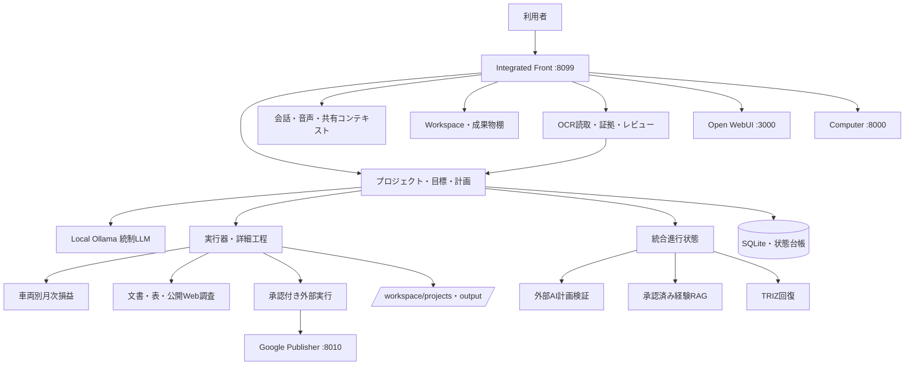
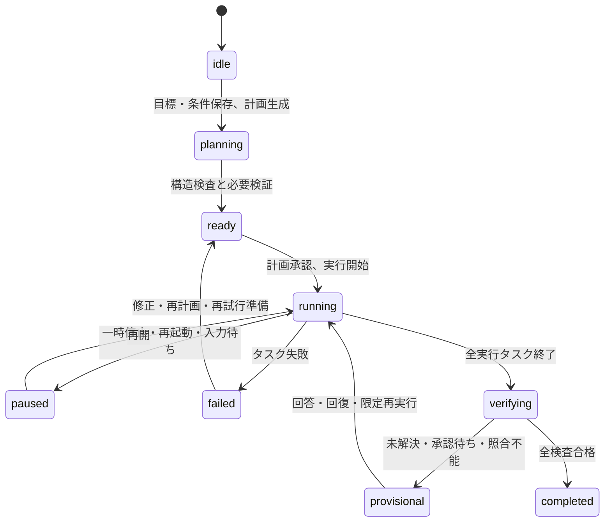

# セバス 最新システム機能・処理フロー・操作ガイド（他AI向け）

- 作成日: 2026-09-25
- 対象システム: LocalSAPOTER
- 呼称: セバス
- 目的: 他のAIまたは新しい開発担当が、現行機能、内部処理、利用者操作、安全条件、停止時の判断を誤解せず、調査・保守・再開できるようにする
- 基準: 2026-09-25時点の現行コード、稼働API、稼働サービス、BUILD_REPORT、最新CHANGELOG
- OCR方針: ユーザー判断により改善工程は終了。今後は保守・不具合修正・回帰防止として扱う

## 0. 最初に理解すること

セバスは、単純なチャット画面ではない。プロジェクトごとに目標、達成条件、制約、原本、計画、タスク、成果物、検証、承認、失敗、再開、再利用知識を保持するローカル優先の業務実行システムである。

主要原則は次のとおり。

1. 通常処理はローカルOllamaを使う。
2. 外部AIは、利用者が明示的に許可した公開可能情報の調査・計画検証に限る。
3. プロジェクト原本、個人情報、会計資料、認証情報を外部AIへ送らない。
4. 計画や文書を作っただけで、実業務を完了扱いにしない。
5. 外部送信、公開、契約、顧客連絡などは人間承認を必要とする。
6. 不明な金額、料率、配賦、業務事実を推測しない。
7. 成果物が存在しても、未解決事項や照合不一致があれば暫定成果とする。
8. 人間が確認して問題がない結果だけを、条件付きでRAGへ登録できる。
9. TRIZの候補生成だけを成功としない。試験と元業務の回復確認が必要。
10. OCRは入力取得機能であり、目標達成判定そのものではない。

## 1. 情報源の優先順位

他のAIが現状を判断するときは、次の順で参照する。

1. 稼働中APIと現行コード
2. `BUILD_REPORT.md` の最新日付部分
3. 日付付きCHANGELOGと最新の再開記録
4. 本書
5. `README.md`、`OPERATIONS.md`
6. `SYSTEM_DESCRIPTION_FOR_AI.md` など旧概要文書

旧文書には、後から追加された車両損益、統合進行状態、計画指摘反映、承認済みRAG、分野横断TRIZ、OCRレビューなどが反映されていない場合がある。古い文書だけを根拠に、機能が存在しないと判断してはいけない。

重要ファイル:

- `BUILD_REPORT.md`: 実装と検証の時系列記録
- `docs/CHANGELOG_2026-09-25_vehicle_pnl_and_ocr.md`: 車両損益とOCRの最新変更記録
- `docs/SEBAS_GOAL_COMPLETION_REORGANIZATION_2026-09-25.md`: 次期全体再整理案
- `README.md`: 基本利用方法
- `OPERATIONS.md`: 起動・停止・運用
- `SECURITY.md`: 安全境界
- `EXPERIENCE_RAG_OPERATIONS.md`: 経験RAG運用

## 2. 現在の稼働構成

| サービス | URL | 役割 |
|---|---|---|
| Integrated Front / web | http://127.0.0.1:8099 | セバスの主画面、目標・計画・実行・検証・承認・各専門機能 |
| Open WebUI | http://127.0.0.1:3000 | ローカルモデルの会話、Knowledge/RAG |
| Computer | http://127.0.0.1:8000 | Workspace、Editor、Terminal、Git、Agent/MCP |
| Google Publisher Browser | http://127.0.0.1:8010 | 承認済みGoogle公開処理の専用ブラウザ |
| Windows Ollama | http://127.0.0.1:11434 | ローカルLLM推論 |

全ポートはlocalhost限定。ホストからComputerへ渡す領域は `C:\LocalCowork\workspace` のみ。

2026-09-25の実測:

- web: healthy
- open-webui: healthy
- cptr: running
- google-publisher-browser: healthy
- `scripts/healthcheck.ps1`: 全項目PASS
- 統合フロントの選択モデル: `mistral-small3.2:24b-instruct-2506-q4_K_M`
- 検出済みモデル: `gpt-oss:20b`、`qwen3.5:9b`
- 最新保存済み全体検証: 本番イメージ内656 tests passed
- 稼働イメージにはpytestがなく、本書作成時にはテストを再実行していない

## 3. 全体アーキテクチャ



## 4. Workspace

Windows側:

- `C:\LocalCowork\workspace\inbox`: 入力原本
- `C:\LocalCowork\workspace\projects`: 案件ごとの作業中ファイル
- `C:\LocalCowork\workspace\knowledge`: 参照資料
- `C:\LocalCowork\workspace\output`: 完成成果物・報告書
- `C:\LocalCowork\workspace\temp`: 一時ファイル

コンテナ内は `/workspace`。

Workspace操作は `mkdir`、`write_text`、`append_text`、`copy`、`move` に制限される。削除、任意シェル、パス脱出、symlink経由の範囲外アクセスは拒否される。上書き前のファイルは `.local_cowork_backups/` へ退避する。

## 5. 現在の主要機能

### 5.1 ローカルチャット・音声

- WebSocketによるストリーミング会話
- プロジェクト別の固定コンテキストと会話履歴
- ブラウザマイクまたはWindowsマイク
- faster-whisper-smallによる文字起こし
- ブラウザ音声合成
- 回答履歴のMarkdown保存
- ローカルモデル選択と切替
- 実行中処理がある場合のモデル切替拒否
- 新モデル切替失敗時の旧モデル復帰

### 5.2 プロジェクトと原本

- プロジェクト作成、更新、削除
- 目標、達成条件、制約、追加指示
- Markdownおよび各種原本ファイルの登録
- フォルダ単位の再帰登録
- 原本ダウンロード
- 会計Excelの内容確認
- PDF、DOCX、XLSX、PPTX、CSV、テキスト、ソースなどの本文抽出
- 抽出できないバイナリも原本目録として保持
- 原本ID、SHA256、抽出本文を計画・検証へ利用

原本制限の代表値:

- フォルダ選択1回: 最大200ファイル
- 1原本: 最大10MB
- プロジェクト全体: 原本100MB、抽出本文2,000,000文字
- AIへ渡す本文: 要求ごとに最大60,000文字

### 5.3 目標からの計画生成

- 目標、達成条件、制約を保存
- ローカルLLMが構造化計画を生成
- タスクごとに依存関係、入力、出力、受入条件を設定
- 計画構造をJSON Schemaで検査
- 登録原本IDをバックエンド側で確定
- 原本確認工程を先頭へ追加
- 公開Web調査が必要な場合は後続タスクの依存元へ配置
- 最後に全タスクと全成果物を確認する最終検証タスクを追加
- 実現できない能力を `capability_gaps` として記録
- 計画版と内容の署名を保持

現状の注意点: 長い目標が少数の成功条件へ縮約される場合がある。計画が生成できたことと、目標を十分に分解できたことは同義ではない。

### 5.4 計画の外部AI検証と指摘反映

- 現行計画版の署名に結び付いた外部検証
- 外部送信可能な公開要約の作成
- 送信前の明示承認
- 複数外部AIの回答取得
- 計画指摘の取込
- ローカルOllamaによる修正案作成
- 指摘と変更の対応表
- 修正前後の確認
- 人間確認後の計画反映
- 反映後の再検証
- 外部AI予算待ちキュー
- 同一packetの回答キャッシュ
- 追加開発や業務事実が必要な指摘の実行阻止

外部AIは助言者であり、最終決定者ではない。固定コンテキストや私的原本は送らない。

### 5.5 計画実行

- 計画承認後の実行開始
- 依存関係を守ったタスク実行
- 独立タスクの上限付き並列実行
- 一時停止、中止、再開、失敗タスク再試行
- タスク出力の機械検査
- 詳細工程のcheckpoint
- 検査不合格成果物の `.local_cowork_rejected/` への隔離
- 状態・中途報告・イベントのSQLite永続化
- `__project_memory__/00_goal.md`
- `__project_memory__/10_plan_and_procedure.md`
- `__project_memory__/20_execution_log.md`
- `__project_memory__/90_final_report.md`
- 再起動時に実行中計画を安全側の一時停止へ復元

### 5.6 統合進行状態

`app/workflow_readiness.py` が、計画、外部検証、指摘、ジョブ、車両損益、照合、未解決事項を読み合わせる。

主なphase:

| phase | 意味 |
|---|---|
| running | 処理中 |
| accuracy_blocked | 原本読取または原本照合で停止 |
| fact_confirm | 配賦・業務事実の回答待ち |
| dev_blocked | 追加開発が必要 |
| issues_open | 計画への指摘が未反映 |
| waiting_budget | 外部検証予算の回復待ち |
| unverified | 必須の外部検証が未合格 |
| provisional | 暫定成果の確認待ち |
| complete | 車両損益で全条件を満たした確定完了 |
| idle | 待機 |

画面には目標、計画版、停止理由、次の操作、成果物の暫定・確定を表示し、現在許可されないボタンを無効化する。

現状の制約: 次アクションは説明とボタン制御が中心で、全処理を連続実行する単一の自動制御器ではない。

### 5.7 成果物棚

- プロジェクト成果物一覧
- ファイル名・種類による絞込み
- テキストプレビュー
- 個別ダウンロード
- ZIP一括ダウンロード
- 現在版と過去版の区別
- mission report、会話履歴、調査結果のMarkdown保存

### 5.8 車両別月次損益

専用処理は次を行う。

1. 登録原本の選定
2. OCRを含む抽出結果の採用
3. 車両、月、人物、給与、社会保険、燃料、リース、その他金額の整理
4. 読取失敗と真正の欠損を分離
5. 業務確認事項と配賦回答の適用
6. 車両別・月別計算
7. 車両別シートを含むExcel生成
8. LibreOffice等による再計算
9. 独立計算との照合
10. 原本統制値、請求単位、配賦算術、会社合計の照合
11. 未解決事項があれば `needs_review` と暫定判定
12. 全条件を満たした場合だけ確定完了

主要モジュール:

- `app/vehicle_auto.py`: 原本からの自動抽出・正規化
- `app/vehicle_profit.py`: 損益計算とExcel生成
- `app/vehicle_reconciliation.py`: 独立照合
- `app/vehicle_workflow.py`: 専用計画、出力検証、目標失敗判定
- `app/vehicle_service.py`: UI/API向けサービス

2026-09-25の稼働案件「車両別評価データの作成」:

- plan version: 25
- mission status: ready
- tasks: 4
- workflow phase: accuracy_blocked
- OCR未解決読取: 0
- 未配賦: 225
- 原本照合: unavailable
- 停止理由: 原本統制値不足
- 成果物は確定扱いにできない

### 5.9 OCR

実装済み機能:

- 登録PDFに対するOCR要求
- OCR runの永続化
- 実行状態と結果取得
- ページ・field単位の証拠
- artifact一覧と取得
- 人間レビュー
- 採用結果の公開
- 人間承認済みOCR結果のRAG登録
- RAG取消
- 車両自動抽出への採用結果接続
- 機能フラグによる有効・無効制御
- 失敗時の原本・途中結果保持

主要モジュール:

- `app/ocr_client.py`
- `app/ocr_fallback.py`
- `app/ocr_invoice_adapter.py`
- `app/ocr_schema.py`
- `app/ocr_store.py`
- `app/ocr_artifacts.py`
- `app/ocr_review.py`
- `app/static/ocr_review.js`

現在方針: OCR改善は終了済み。新機能提案を繰り返さず、既知不具合、設定、回帰、実案件での運用状態だけを確認する。過去CHANGELOGには実PDF受入やPaddleOCR実起動が未実施だった時点の記録があるため、開発終了の判断と過去の実証履歴を混同しない。

### 5.10 人間承認済み経験RAG

- 成功・失敗経験をproject単位で保存
- 人間がreviewer、proof、期限を指定してverified化
- 最大366日以内の有効期限
- 取消
- ベクトル検索後にDBで再検査
- project、入力版、適用条件の一致確認
- 原本・成果物ハッシュの再確認
- 期限切れ、取消、他projectの記録を拒否
- 取得監査ログ
- 外部AIの同一packet回答キャッシュ
- 予算上限
- shadow/enforceモード
- 承認済みOCR、実行例、手順学習との接続

RAGで見つかったこと自体は成功ではない。再利用後に現案件の受入条件を再検証する。

### 5.11 実行例の模倣・手順学習

- 成功した実行例の保存
- 入出力、操作、検証、適用条件の保持
- 人間レビュー
- project内再利用
- 手順の段階化
- 条件不一致時の拒否
- 原本や成果物の版が変わった場合の再確認
- 要確認一覧からのレビュー

関連モジュール:

- `app/agent_examples.py`
- `app/agent_examples_api.py`
- `app/procedure_learning.py`
- `app/procedure_learning_api.py`
- `app/learning_tables.py`
- `app/executable_recipes.py`

### 5.12 TRIZ

三つの層がある。

1. TRIZ発明: 失敗・能力不足から矛盾、理想、資源、未知事項、候補を生成
2. 分野横断TRIZ: 文書、調査、ソフトウェア、業務、障害、ブラウザ、その他に分類
3. 自動TRIZ回復: 車両損益等の失敗を分類し、既知P0不具合と未知問題を分離

安全条件:

- 既知不具合は `development_required` とし、TRIZへ逃がさない
- 入力不足と業務事実不足を発明問題にしない
- 候補は登録済み入力だけを参照
- 再現ケースと転用ケースの両方に合格した候補だけ採用可能
- 採用後は限定再実行
- 元業務の検査に合格した `business_recovered` だけ成功
- 失敗時は取消して旧経路へ戻す
- 任意コードや未接続能力を実行済みと偽らない

主要モジュール:

- `app/triz_invention.py`
- `app/triz_general.py`
- `app/automatic_triz.py`
- `app/triz_adapters.py`
- `app/triz_api.py`
- `app/triz_general_api.py`

### 5.13 公開Web調査

- ユーザーが明示指示した場合だけ実行
- HTTPS公開情報だけを取得
- 公式一次資料・公式PDFを優先
- URL、取得日時、本文SHA256、抽出本文を原本として保存
- 秘密資料を検索語へ混ぜない
- ローカルLLMが取得本文を分析
- URLを取得できない重要事項は要確認
- 調査結果を後続タスクの入力にする

### 5.14 承認付き外部実行

対象:

- email
- proposal
- meeting
- poc
- contract
- manual

操作は、登録 → 内容確認 → 承認 → 実行または外部実施 → 証拠登録の順。販売目標などで実操作が必要な場合、資料作成だけでは完了しない。

### 5.15 プレマーケティング・Google公開・SNS

- キャンペーン設計
- ランディングページ文案
- コンテンツカレンダー
- 同意フォーム
- リード評価
- 60点以上のリードを承認待ちアクションへ登録
- Google公開申請
- 人間承認
- Googleフォーム公開
- Google Sites用資材生成
- Google Sites公開フロー
- SNS投稿キット
- 投稿文面承認
- 投稿画面を開く
- 人間が投稿
- 投稿URLを証拠登録
- フォーム回答同期

Googleログイン、2FA、CAPTCHA、OAuth同意、SNS投稿そのものは人間が行う。フォーム公開、LP公開、SNS文案、顧客連絡は別々の承認。

## 6. 通常の利用者操作

### 6.1 起動

PowerShell:

```powershell
Set-Location 'C:\LocalCowork\sebas'
.\scripts\start.ps1
.\scripts\status.ps1
.\scripts\healthcheck.ps1
```

初回またはweb再ビルド時:

```powershell
.\scripts\start.ps1 -BuildFront -Check
```

### 6.2 新規プロジェクトの標準操作

1. Integrated Frontを開く。
2. 新規プロジェクトを作る。
3. 固定コンテキストへ会社、対象範囲、禁止事項を入力する。
4. 原本をファイルまたは調査フォルダから登録する。
5. 目標、達成条件、制約を入力して保存する。
6. 追加指示があれば保存する。
7. 「AIで計画生成」を実行する。
8. 計画タスク、依存関係、成果物、未確認事項を確認する。
9. 外部計画検証が必須なら、公開草案を確認し、送信を承認する。
10. 外部AIの指摘があれば取込み、修正案を生成する。
11. 変更内容を確認して計画へ反映する。
12. 再検証後、計画を人間承認する。
13. 実行開始する。
14. 「進行状態」「中途報告」「イベント」「成果物棚」を確認する。
15. `needs_input` 相当の停止なら、必要な業務事実だけ回答する。
16. 失敗なら原因分類を確認し、再試行、RAG、TRIZ、追加開発のどれかへ進む。
17. 最終検証を実行する。
18. 暫定成果と確定成果を区別する。
19. 人間が結果を確認する。
20. 問題がなければ結果をRAGへ登録する。
21. 実行報告と成果物を保存する。

### 6.3 車両損益の操作

1. 車両損益プロジェクトを選ぶ。
2. 給与、社会保険、燃料、リース、車両台帳、対応表などを登録する。
3. 必要なPDFでOCRを実行し、証拠を確認して採用する。
4. 「原本から自動抽出を更新」を実行する。
5. 読取問題、未配賦、統制値、対象期間、車両件数を確認する。
6. 既回答の業務確認事項を適用する。
7. 残る配賦質問へ回答する。
8. 車両別月次計算を実行する。
9. Excelと検証JSONを生成する。
10. 独立照合結果を確認する。
11. 未配賦、読取失敗、照合不能が残れば暫定として修正する。
12. 全条件合格後に人間が確定結果を確認する。
13. 承認済み結果だけRAG登録する。

### 6.4 OCRの操作

1. 対象projectの原本一覧でPDFを選ぶ。
2. OCR実行を要求する。
3. run状態、artifact、field証拠を確認する。
4. 読取結果を人間レビューする。
5. 問題がなければ採用・公開する。
6. 再利用価値があれば、証拠付きでRAG登録する。
7. 誤りが判明した場合はRAGを取消す。

OCR結果を公開しただけでは、車両損益や他の業務目標は完了しない。下流処理を再実行し、元の受入条件を検査する。

## 7. 内部の目標処理フロー



注意: 現行実装には、上記mission状態に加えてgoal review、queue、job、vehicle、TRIZ、RAGの個別状態がある。`workflow_readiness.py` が統合表示するが、まだ単一状態機械ではない。

## 8. 停止したときの判断順序

他のAIは、停止を見たら次の順で調べる。

1. `GET /api/health` と `scripts/healthcheck.ps1`
2. 対象projectのmission status
3. `GET /api/projects/{id}/workflow-readiness`
4. active_job、blocking_error、resume_from
5. 原本読取失敗と原本照合
6. 未配賦・業務事実
7. 計画指摘とdevelopment blockers
8. 外部検証の現行版署名と合格状態
9. 人間の計画承認
10. タスク依存と成果物検査
11. 承認付き外部実行の証拠
12. 承認済みRAGの適用可能性
13. 一時失敗の安全な再試行
14. 未知の方法不足ならTRIZ
15. 元の達成条件を再検証

停止理由別:

| 状態 | 最初の対応 |
|---|---|
| accuracy_blocked | 原本読取、統制値、照合差額を確認 |
| fact_confirm | 未配賦・業務事実の最小質問へ回答 |
| dev_blocked | 必要能力とテストを定義して改修 |
| issues_open | 指摘から修正案を生成し反映 |
| waiting_budget | 保存済みpacketを保持して回復後再開 |
| unverified | 現行計画版を検証 |
| provisional | 暫定成果と未達条件を確認 |
| runningが残留 | job、成果物、checkpoint、ロックを照合 |

## 9. 主要API

### プロジェクト・目標

- `GET/POST /api/projects`
- `PUT/DELETE /api/projects/{project_id}`
- `GET/PUT /api/projects/{project_id}/mission`
- `POST /api/projects/{project_id}/mission/instructions`
- `POST /api/projects/{project_id}/mission/plan/generate`
- `POST /api/projects/{project_id}/mission/plan/approve`
- `POST /api/projects/{project_id}/mission/start|pause|cancel|retry|verify`

### 統合状態・外部計画検証

- `GET /api/projects/{project_id}/workflow-readiness`
- `GET /api/projects/{project_id}/goal-review`
- `POST /goal-review/plan`
- `POST /goal-review/send-approval`
- `POST /goal-review/feedback/import`
- `POST /goal-review/feedback/propose`
- `POST /goal-review/feedback/apply`
- `POST /goal-review/result`
- `POST /goal-review/revoke`
- `POST /goal-review/index`

### 原本・Workspace・成果物

- `GET/POST /api/projects/{project_id}/context-files`
- `POST /context-files/materialize`
- `GET /context-files/{file_id}/download`
- `GET /context-files/{file_id}/accounting-preview`
- `GET /api/projects/{project_id}/workspace`
- `POST /workspace/operations`
- `POST /workspace/upload`
- `GET /mission/artifacts/download`

### 車両損益

- `GET /api/projects/{project_id}/vehicle-profit`
- `POST /vehicle-profit/input`
- `POST /vehicle-profit/prepare`
- `POST /vehicle-profit/decision`

### OCR

- `POST /context-files/{file_id}/ocr`
- `GET /context-files/{file_id}/ocr`
- `GET /ocr/{run_id}`
- `GET /ocr/{run_id}/artifacts`
- `GET /ocr/{run_id}/evidence/{field_id}`
- `POST /ocr/{run_id}/review`
- `POST /ocr/{run_id}/publish`
- `POST /ocr/{run_id}/rag`

### 承認付き外部アクション

- `GET/POST /api/projects/{project_id}/actions`
- `POST /actions/{action_id}/approve`
- `POST /actions/{action_id}/execute`
- `POST /actions/{action_id}/complete`

### 会話・調査・音声

- `WS /ws/chat`
- `POST /api/research`
- `GET /api/research/providers`
- `POST /api/transcribe`
- `GET/POST /api/mic/health|start|stop`
- `GET /api/history`

プレマーケティング、Google公開、SNSのAPIは `app/web.py` の `/premarketing/` 系を参照する。

## 10. 主要コード

| ファイル | 役割 |
|---|---|
| `app/web.py` | FastAPI、画面、全主要API |
| `app/project_manager.py` | プロジェクト、mission、計画、タスク実行の中核 |
| `app/structured_planning.py` | 構造化計画、契約、計画・成果物検査 |
| `app/step_executor.py` | 詳細工程とcheckpoint |
| `app/workflow_readiness.py` | 統合進行状態、停止理由、ボタン可否 |
| `app/goal_review.py` | 外部検証、計画版、結果承認、RAG登録 |
| `app/plan_feedback.py` | 外部指摘、修正案、反映 |
| `app/experience_memory.py` | 経験検索、scope、外部回答cache |
| `app/experience_store.py` | 経験・レビュー・予算のSQLite |
| `app/automatic_triz.py` | 自動TRIZ回復 |
| `app/vehicle_workflow.py` | 車両損益の計画・目標検査 |
| `app/ocr_review.py` | OCRレビューと公開 |
| `app/public_web_research.py` | 公開Web証拠取得 |
| `app/workspace_files.py` | 安全なWorkspace操作 |
| `app/static/project_mission.js` | mission UI |
| `app/static/workflow_readiness.js` | 進行状態UI |
| `app/static/goal_review.js` | 計画検証・RAG UI |
| `app/static/artifact_shelf.js` | 成果物棚 |
| `app/static/ocr_review.js` | OCR UI |

## 11. 永続化と版

主状態はSQLiteへ保存される。関連DBにはmission、context、goal review、experience memory、手順学習、実行例、OCRなどがある。正確なパスは設定と各Store実装から確認すること。認証情報をDB、イベント、文書へ複写してはいけない。

版管理で重要な値:

- mission `plan_version`
- plan signature
- 原本ID、SHA256、content hash
- vehicle engine revision
- OCR run IDと採用版
- artifact hash
- external packet hash
- RAG experience ID、期限、取消状態
- TRIZ recipe hash、再現・転用試験結果

入力、計画、成果物のいずれかが変わった場合、古い検証・承認をそのまま流用しない。

## 12. 安全上の禁止事項

- `docker system prune -a`
- `docker volume prune`
- `docker compose down -v`
- C:\、D:\、X:/、C:\Users全体のマウント
- Docker socket、SSH秘密鍵、Windows Credential領域の公開
- 3000、8000、8099の0.0.0.0公開
- ユーザー未承認のpackage install、git push、外部送信
- 任意スクリプトのdownload-and-run
- 認証情報のログ・文書・Git保存
- 未確認の業務数値や配賦の推測
- CAPTCHA、2FA、ログイン保護の回避
- TRIZ候補の無検証採用
- RAG検索結果を検証せず実行
- 暫定Excelを確定成果と呼ぶ

## 13. 開発・変更時の手順

1. 本書、AGENTS.md、BUILD_REPORT最新節を読む。
2. 稼働APIと対象コードで現状を再確認する。
3. 入力原本、DB、Docker volume、モデル、履歴を保全する。
4. 変更対象と非対象を明示する。
5. 既存の状態、版、承認、証拠を壊さない方法で実装する。
6. 関連受入テストを実行する。
7. `scripts/healthcheck.ps1` を実行する。
8. 実案件で実行しない場合は「本番未実証」と明記する。
9. BUILD_REPORTと日付付きCHANGELOGへ結果を残す。
10. rollback手順とイメージまたはbackupを残す。
11. ユーザーの代わりに計画承認、結果承認、RAG承認を記録しない。

## 14. 現在の重要な不足

セバスは多数の高度機能を持つが、次は未統合。

- 長い目標を機械判定可能な達成条件へ漏れなく分解するGoalContract
- 達成条件とタスク・成果物・証拠を結ぶ計画被覆表
- mission、review、job、vehicle、TRIZ、RAGを統合する単一状態機械
- 全分野共通のCompletion Gate
- 次の安全な処理を自動連鎖するNext Action Controller
- 原本から成果物の値まで追跡する証拠グラフ
- UI上の人間質問の最小化
- 現状文書の自動生成
- 稼働ソースとreleaseの一意な版管理

次期方針は `docs/SEBAS_GOAL_COMPLETION_REORGANIZATION_2026-09-25.md` を参照する。

## 15. 他のAIが回答・操作するときの判断規則

1. 「実装済み」と「実案件で目標達成済み」を分ける。
2. BUILD_REPORTの古い成功件数より最新節を優先する。
3. OCR改善を再提案しない。問題があれば不具合として切り分ける。
4. 車両損益が止まっている場合、最初にOCRを疑わない。readinessの未配賦と原本照合を見る。
5. 未配賦や業務事実を0円で埋めない。
6. 外部AIを使う前に送信許可と公開packetを確認する。
7. 計画指摘は自由文のまま放置せず、現行版へ反映・却下・開発待ちを記録する。
8. RAGは人間承認、適用条件、版、期限、証拠を検査する。
9. TRIZは入力不足や既知不具合の代替にしない。
10. 成果物があっても、目標別検証が不合格なら終了と報告しない。
11. 不明な場合は機能名ではなく、止まっている達成条件と必要証拠を特定する。
12. UI操作を案内するときは、現在phaseで許可された操作だけを案内する。

## 16. 一文での説明

セバスは、ローカルLLMを中心に、プロジェクト原本から計画を作り、人間承認の下で実行し、成果物と証拠を検証し、成功手順をRAGで再利用し、未知の失敗をTRIZで回復する業務実行基盤である。現在は各機能が実装されているが、目標達成までを一本で自動統括する制御層の統合が次の開発課題である。
