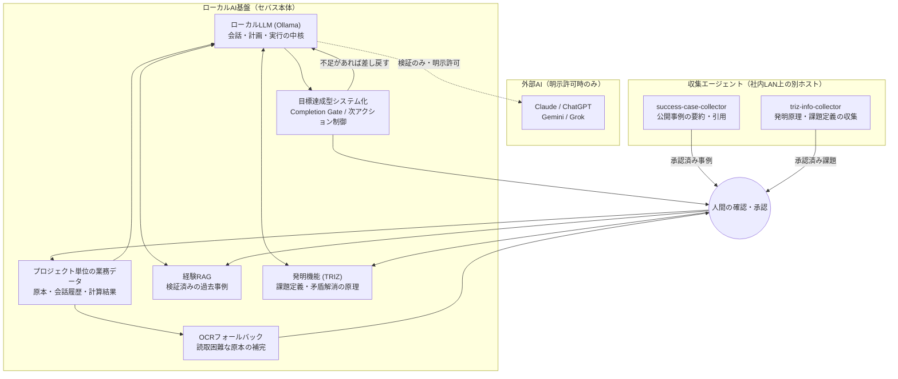

# セバス ―― 経験・知識・発明を重ねるローカルAI

セバスは、社内の業務データと会話履歴だけで動くローカルAI基盤です。単なる対話に留めず、**経験（過去の成功事例）・知識（TRIZ発明原理）・完走管理（目標達成の検証）**の3つの機能を重ねることで、大規模クラウドAIに頼らずとも高度な業務遂行に近づけることを目指しています。

## システム構成図

実線は日常的なデータの流れ、点線は明示許可がある場合のみ発生する外部AI連携です。収集エージェントの結果とOCRの読取結果は、必ず人間の確認を経てからセバス本体（経験RAG・発明機能・業務データ）に取り込まれます。

## 3つの追加機能

### 経験（Experience RAG）
社内外の「うまくいった事例」を、状況・施策・成果・成功要因の形で蓄積します。似た状況に直面したとき、AIが一から考えるのではなく、実証済みの打ち手を思い出せるようにします。

### 知識・発明（TRIZ）
矛盾を解消する発明原理（TRIZ）の考え方を、課題定義として蓄積します。「Aを良くするとBが悪化する」という板挟みに対し、既知の発明パターンから解決の糸口を探せるようにします。

### 完走管理（目標達成型システム化）
AIが「できました」と報告して終わりにせず、未読取・未確認の項目が残っている限り達成と認めない仕組みです。原本の読取失敗や、人による最終確認（承認）が無いものは、暫定扱いのまま次のアクションを促します。空欄や不明点を0円・成功として握りつぶさないことを、設計の中心に置いています。

## 収集エージェントの役割

経験RAGとTRIZの「材料」は、社内で手作業で集めるだけでなく、社内LAN上で常時稼働する2つの収集エージェントが、公開情報から日次で候補を集めています。

| エージェント | 収集対象 | 承認 / 下書き / 却下 | 実行間隔 |
|---|---|---|---|
| success-case-collector | 公開されたAI活用・業務改善の成功事例 | 30 / 30 / 86 | 毎日 05:00 |
| triz-info-collector | 設計・業務課題とその解決原理（TRIZ） | 145 / 145 / 32 | 毎日 04:00 |

### 取り込みまでの流れ

1. **収集** ―― 公開ページから候補を機械的に抽出。出典URL・取得時刻・本文のSHA-256・引用箇所を必ず記録します。
2. **下書き判定** ―― 重複・引用不備・成果指標が無いものなどを機械的に除外し、残りを下書きとして提示します。
3. **人間のレビュー** ―― 内容と出典を人が見て承認・却下します。ここを経ないものは、セバス側にはまだ存在しません。
4. **セバスへの登録** ―― 承認済みの内容だけを、経験RAGまたはTRIZ課題として取り込みます。取り込み後も「人手レビュー済み」の証跡を残します。

現状は取り込み口（API）を新設した段階で、承認済み事例の本番反映はこれから順次進めます。会計分野の情報源は却下が続いており、改善の余地があります。

## 期待される効果

1. **判断のたたき台が増える** ―― 似た状況の過去事例や発明原理を参照できるため、AIが白紙から考えるより、現実的な打ち手に早くたどり着けます。
2. **「言い切り」を防ぐ** ―― 完走管理により、未確認のまま完了と報告することを防ぎ、原本や人の確認が必要な箇所を明示し続けます。
3. **社外送信を抑えたまま高度化できる** ―― 経験・知識の蓄積はローカル側で完結するため、会計や取引先の情報を外部AIに渡す機会を増やさずに、判断の質を上げられます。
4. **使うほど育つ** ―― 収集エージェントが日々候補を運び、レビューを重ねるほど、経験と発明の蓄積が厚くなっていきます。

## この取り組みで最も大事にしていること

AIの「知能」そのものは、クラウドの大規模モデルに及ばないかもしれません。しかし、**経験・知識・発明という3つの機能を重ねていけば、ローカルで動く小さなAIでも、高度な判断に近づけるのではないか**――この期待感こそが、セバスに時間をかけている理由です。

収集エージェントが運んでくる事例やアイデアは、その仮説を検証していくための材料です。今はまだ発展途上ですが、積み上げの方向は間違っていないと考えています。

---

図解版（PDF）は [`セバス.pdf`](セバス.pdf) を参照してください。数値は2026年9月時点の収集エージェント稼働実績です。
